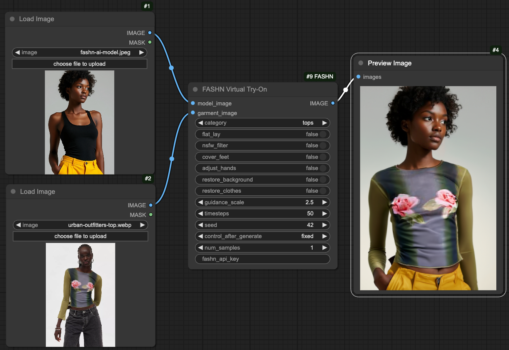

# FASHN Virtual Try-On Node for ComfyUI

This repository implements a ComfyUI node for the FASHN AI Virtual Try-On API. 

<p align="center">
    
</p>

**Model image** - Generated in the FASHN AI platform <br> **Garment image** - https://www.urbanoutfitters.com/shop/kimchi-blue-katie-mesh-floral-graphic-long-sleeve-tee

### Sign Up to FASHN
This node requires an API key from a FASHN account.
Don't have an account yet? [Create an account](https://app.fashn.ai/).

If you already have an account, go to Settings → API → `+ Create new API key`

### Setup

You can install this node in 2 ways:
1. ComfyUI Manager — Search for `FASHN Virtual Try-On` and click `install`
—— or ——
2. Clone the repository into your `custom_nodes` folder in ComfyUI
```bash
cd custom_nodes
git clone https://github.com/fashn-AI/ComfyUI-FASHN.git
```

### Using the API Key

You can provide the API key to the node in 2 ways:

1. *[Recommended]* Set the environment variable `FASHN_API_KEY` to the API key you created on the FASHN platform.
—— or ——
2. Directly paste the API key into the node's `fashn_api_key` field. <br> *This is less recommended because you might accidentally expose your API key when sharing your workflow.*

### Quick Start

An example worflow, as shown in the screenshot above, is provided in a `workflow.json` file in this repository. Alternatively, you can drag-and-drop the following image into ComfyUI:

<p align="center">
    
</p>